### Intro
Incident response procedures are a critical part of any organization's security posture.

#### Objectives
In this lab, we will exploit a remote system, analyze web logs, and perform incident response on a compromised host

#### Outcomes
1. Scan a network with nmap/zenmap
2. exploit a system using Bruter
3. Use remote desktop to access a compromised system

#### Tools
1. netstat: Analyzing Active Connections
2. tasklist: Identifying Running Processes
3. ipconfig: Identifying Network Configuration and MAC Addresses
4. path: Identifying the System Path
5. md5sum: Calculating MD5 Hashes

#### Background
In this lab, you will get to be the attacker and then you will be able to see what the artifacts are left on the victim machine running Windows server. As the attacker, you will first exploit the remote system. After attacking the victim machine, you will analyze web logs and perform incident response on the compromised host.

Figure 1 shows the lab topology for this lab. First, you will use the scanning tools nmap/zenmap in order to determine the open ports on the pfSense firewall from an external address. Then, the lab uses Bruter, a GUI-based network brute-forcing tool for Windows systems to determine the password for the administrator using a dictionary attack. After Bruter determines the password of the administrator account, the attacker can leverage the credentials through an RDP session. Once you log in through the RDP session with the harvested credentials, the victim system has been fully compromised.

The next step is to collect incident response data by collecting the state of the machine which includes the date, time, open ports, IP address configuration, network connection state, the list of tasks running on the machine, information about logged users, and list of users on the system into an incident response report. After you do this initial work, you will review the logs to determine successful login events. You determine from the review of the logs that you have been hacked through a forensics investigation.

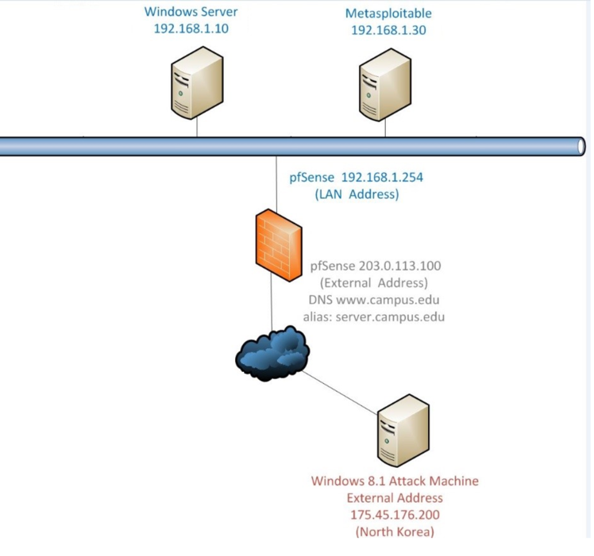

##### The Breach
Unfortunately, security breaches are becoming commonplace in the industry because of the lack of proper protections and controls in place to stop attacks from happening. Today, it often feels like it is a matter of when and not if you will be hacked anymore. As a system administrator, it is critically important to have an incident response plan in place so the organization knows how to react and collect artifacts when a breach occurs.

One common issue in information technology systems today is the lack of complex passwords. Lack of complexity in passwords allows hackers to use password dictionaries (a list of commonly used passwords) to do brute force attacks on your systems to uncover credentials.

##### Nmap and Zenmap
The first step in a brute force attack is to plan the attack. After planning, the attacker can use scanning tools like nmap and zenmap to have a more in-depth understand of the network. Then, the next step is to attempt to gain access to the system through various means like a default username and password. In this case, Bruter must try several thousand password combinations to get the administrative credentials. Nmap/zenmap is a network scanning tool that provides information about the open ports of a system to determine vulnerabilities. Figure 2 shows the Zenmap tool which is an Nmap GUI.

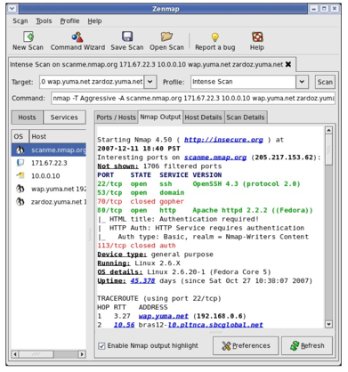

##### Bruter
Bruter is a brute force tool that assists hackers into using list of commonly used passwords called a dictionary to repeatedly try logins until the tool is successful and reports the password that it detected as valid. In this lab, you were able to determine the login credentials for the administrator account using Bruter. Figure 3 shows the bruter tool application.

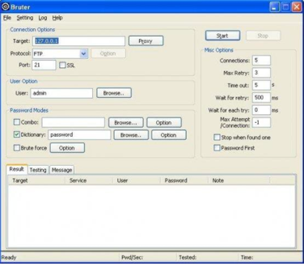

##### Incident Response Life Cycle
Incident Response (IR) is a life cycle that includes preparation, detection and analysis, containment eradication and recovery, and post-incident activity. The system administrator has an incident response toolkit as known as forensic tools to assist in any breaches that occur. NISP SP 800 discusses the incident response life cycle in detail. Figure 4 shows the IR life cycle.

##### Preparation
Preparation is the first step in the IR life cycle to make sure that the organization is prepared to handle an incident through the creation of an Incident Response plan. This plan provides information on the roles of the individuals on the incident response team, the processes and procedures to be used in case of an incident, the forensic tools to be used, and other details needed to respond to an incident. Part of preparation is to prevent incidents in the first place by doing risk assessment and putting the appropriate controls in place.

##### Detection and Analysis
The next part of the cycle is the detection and analysis stage. In this lab, you used logs to detect and analyzed those logs for the potential intrusion and signs of an incident. From the logs themselves, you were able to determine that an attack occurred though the successful logins and what the hackers used to get in.

##### Containment Eradication and Recovery
Part of the containment eradication and recovery, you need to gather information about the systems through an incident response report. In this lab, you created a report that contained the following information: collecting the state of the machine which includes the date, time, open ports, IP address configuration, network connection state, the list of tasks running on the machine, information about logged users, and list of users on the system into an incident response report. Once you have determined the incident, the system administrator needs to isolate the system from use to allow investigators to research the breach.

##### Post-Incident Activity
After the containment eradication and recovery were complete, the next step is to determine the lessons learned and put the appropriate controls in place to prevent another incident occurring. In this scenario, the system administrator learns that he or she needs to have more complex passwords on the system so a group policy could be set up to enforce more complex passwords especially on administrator accounts. Also, there are too many ports open on the system. The system administrator needs to do a system hardening on this system to lock it down from further attacks. For example, FTP (File Transfer Protocol) and Telnet should never allows on internal or external networks since they send credentials in cleartext instead of using encryption like Secure Shell (SSH).

## Procedure
### Launching the Attack
Launching an Attack
Click on the external Windows 8.1 icon on the topology.

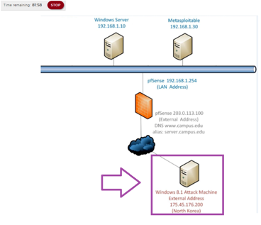

After Windows 8.1 opens, double-click on the desktop cmd - Shortcut.

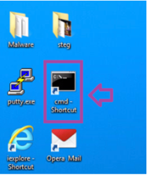

Type the following command to determine what ports are open on the firewall, then press Enter.
C:\>nmap 203.0.113.100

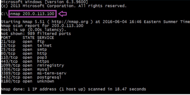

Type the following command then press Enter to open Zenmap. After Zenmap opens, type 203.0.113.100 in the Target box and then click the Scan button to launch an intense scan.
C:\>zenmap

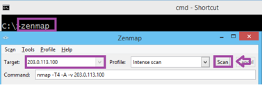

After the scan is complete, click the Ports / Hosts tab to view the open ports and corresponding banner messages that are displayed. Notice FTP is a Microsoft service.
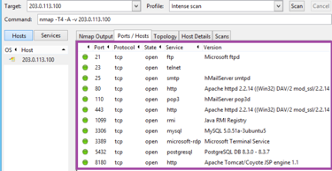

Select Scan from the menu bar and then select Quit to close Zenmap. If an Unsaved Changes window pops up, click the Close anyway button.

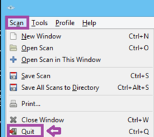

If an Unsaved Changes window pops up, click the Close anyway button.
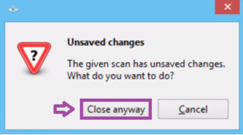

Type exit then press Enter to leave your command prompt session.
C:\>exit

Double-click the Bruter Shortcut on the desktop of the external Windows 8 machine.
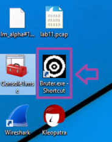

For the Target, type 203.0.113.100. For Protocol, leave FTP and Port 21. For the User, type administrator.
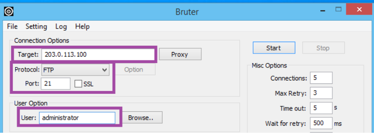

Click Browse next to Dictionary. Click on the Wordlist.txt and then click Open.
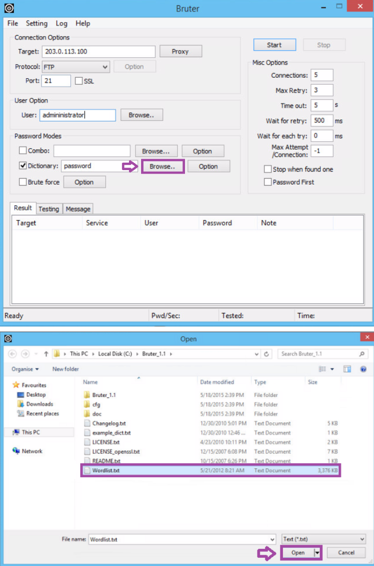

Verify that the Target is 203.0.113.100, the Protocol is FTP, the Port is 21, the User is administrator, and the Dictionary file is Wordlist.txt. Click Start to launch the attack.
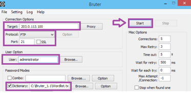

After a few minutes, the attack will be completed and the password will be displayed.
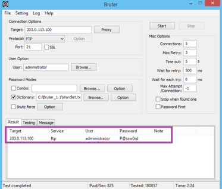

Click the cmd - Shortcut link.

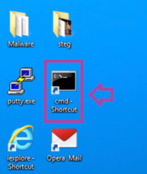

Type the following command to determine if RDP is open on the firewall, then press Enter.
C:\>nmap 203.0.113.100 –p 3389

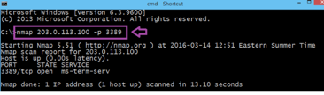

Type the following command to launch the Microsoft Terminal Service Client, then press Enter.
C:\>mstsc
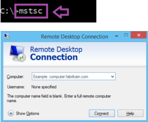

In the Computer box, type 203.0.113.100 and then click the Connect button.
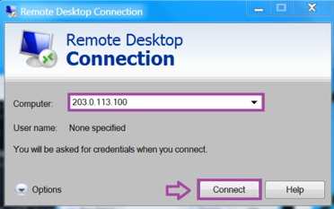

For the username, type administrator, and for the password, type P@ssw0rd. Click OK.
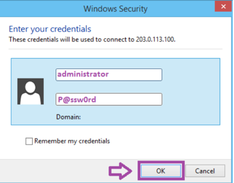

Click Yes on the Remote Desktop Connection warning screen.

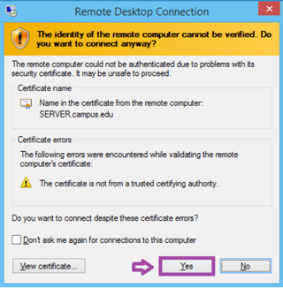

The remote Windows 2008 Server desktop will now be displayed on your machine.
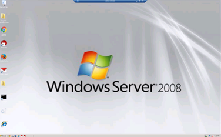

#### Discussion Questions
What is the purpose of nmap?
What is Zenmap?
What is the purpose of Bruter?

### Collecting Incident Response Data
Click on the Windows Server icon in the network topology.
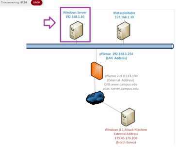

Log in as administrator with the password of P@ssw0rd, then click the arrow.

Click on the Start button in the bottom left hand corner, then click on the Computer link.
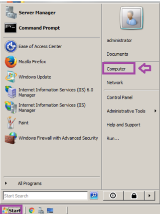

Double-click on the IR_TOOLS (E:) drive.

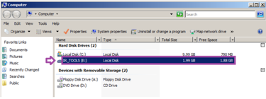

Double-click on cmd.exe within the list of executables.

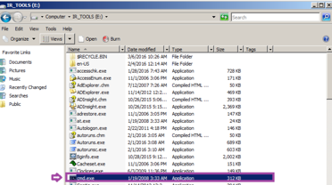

Type the following command to set the PATH to the trusted tool set, then press Enter.
E:\>`PATH=E:\`

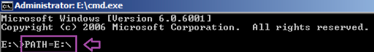

Type the following command to view the PATH, then press Enter.
E:\>`PATH`

Type the following command to add the Incident Responder to the IR.txt file you create, then press Enter.
E:\>`echo Incident Responder Student > IR.TXT`

Type the following command to view the IR.txt file, then press Enter.
E:\>`type ir.txt`

Type the following command to add the date to the IR.txt file, then press Enter.
E:\>`date /t >> ir.txt`

Type the following command to view the IR.txt file, then press Enter.
E:\>`type ir.txt`

Type the following command to add the time to the IR.txt file, then press Enter.
E:\>`time /t >> ir.txt`

Type the following command to view the IR.txt file, then press Enter.
E:\>`type ir.txt`

Type the following command to add the IP address information to the IR.txt file, then press Enter.
E:\>`ipconfig /all >> IR.TXT`

Type the following command to view the IR.txt file, then press Enter.
E:\>`type ir.txt `

Type the following command to add the connection information to the IRir.txt file, then press Enter.
E:\>`netstat –ano >> ir.txt`

Type the following command to view the RDP connection in the IR.txt file, then press Enter.
E:\>`type ir.txt | find “3389”`

Type the following command to add the process information to the IR.txt file, then press Enter.
E:\>`tasklist >> ir.txt`

Type the following command to view the svchost processes in the IR.txt file, then press Enter.
E:\>`type ir.txt | find “svchost”`

Type the following command to add information about logged-on users to the IR.txt file, then press Enter.
E:\>`psloggedon >> ir.txt`

Type the following command to view the administrator account in the IR.txt file, then press Enter.
E:\>`type ir.txt | find “administrator”`

Type the following command to add user account information to the IR.txt file, then press Enter.
E:\>`net user >> ir.txt`

Type the following command to view the Guest account in the IR.txt file, then press Enter.
E:\>`type ir.txt | find “Guest”`

Type the following command to add the time (again) to the IR.txt file, then press Enter.
E:\>`time /t >> ir.txt`

Type the following command to hash the IR.txt file and send the output to hash.txt file, then press Enter.
E:\>`md5sum ir.txt >> hash.txt`

Type the following command to view the Guest account in the IR.txt file., then press Enter.
E:\>`type hash.txt`

Type exit to leave your command prompt session, then press Enter.
C:\>`exit`

#### Discussion Questions
What is ipconfig?
What is netstat?
What is psloggedon?
What is md5sum?

### Reviewing the Logs
Click on the Start button in the bottom left hand corner and then click on the Computer link.
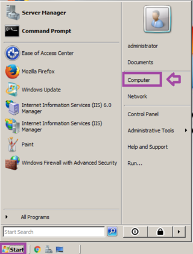

Double-click on the Local Disk (C:) drive.

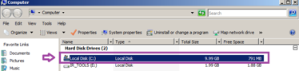

Double-click on the Windows directory (directories are listed alphabetically).
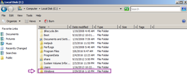

Double-click on the System32 folder (directories are listed alphabetically).
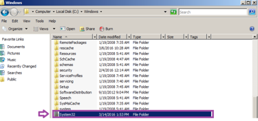

Double-click on the LogFiles directory (directories are listed alphabetically).
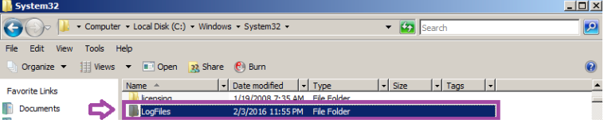

Double-click on the MSFTPSVC1 directory (directories are listed alphabetically).
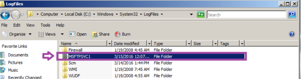

Double-click on the logfile with today’s year, month, and date.
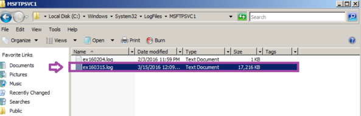

From the Notepad menu bar, select Edit, and then go down to Find.
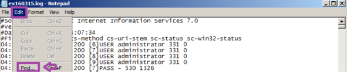

In the Find what field, type 230. Click Find Next and look for a successful login. Close find and then close the notepad log by clicking the x in the right hand corner.

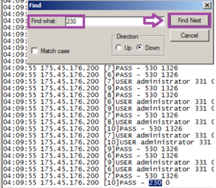

#### Discussion Questions
Where are the logs located in Windows?
What is stored in the MSFTPSVC1 directory?